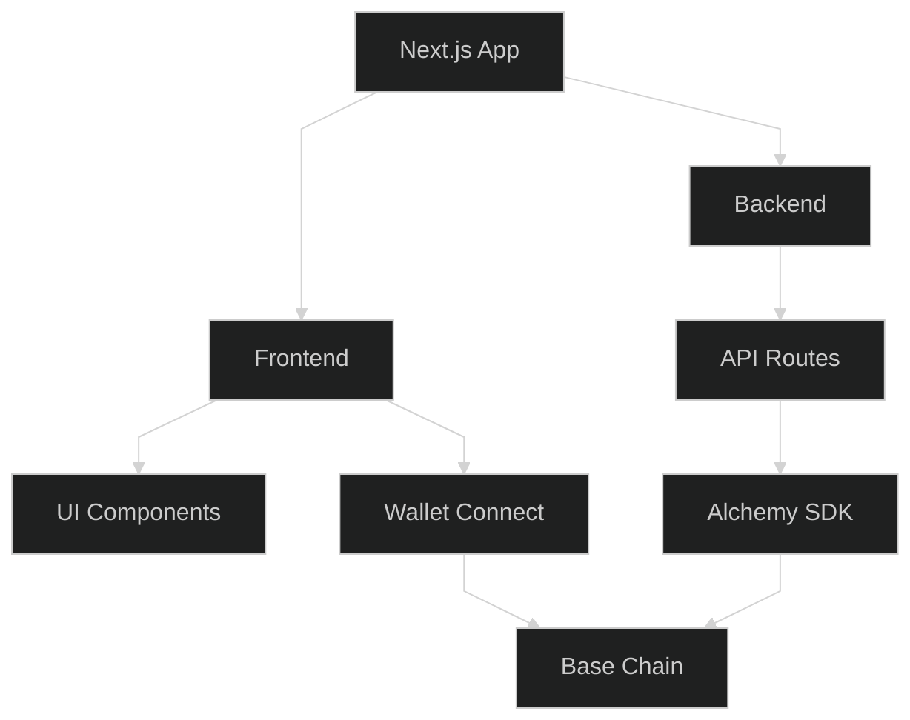

# base.brassey.io

A Web3 Dashboard for the Base blockchain with wallet connection, on-chain identity features, ERC-20 token support, and NFT display capabilities.

## Architecture Overview



## Technical Stack

### Core Framework
- **Next.js 15.2.4**: React framework with App Router
- **React 19.x**: UI library with the latest React features
- **TypeScript 5.x**: Type-safe JavaScript

### Blockchain Integration
- **Wagmi**: React hooks for Ethereum (latest version)
- **Viem**: Low-level Ethereum interface (latest version)
- **Alchemy SDK 3.5.6**: Blockchain API integrations
- **@coinbase/onchainkit**: Base blockchain identity components (latest version)

### Wallet Connection
- **MetaMask**: Browser extension wallet
- **Coinbase Wallet**: Mobile and browser wallet
- **WalletConnect v2**: Universal wallet connector
- **Brave Wallet**: Browser-integrated wallet support

### UI Components
- **Tailwind CSS 3.4.17**: Utility-first CSS framework
- **Radix UI**: Various components (^1.1.x - ^2.1.x)
- **Lucide React 0.454.0**: SVG icon library
- **shadcn/ui**: Component collection built with Radix and Tailwind

### Data Management
- **TanStack Query 5.73.3**: Data fetching and caching library

## Environment Variables

Before running the project, you'll need to set up the following environment variables:

### Required Environment Variables

Create a `.env.local` file in the root of the project with the following variables:

```
# WalletConnect Project ID 
# Get one at https://cloud.walletconnect.com/
WALLETCONNECT_PROJECT_ID=your_project_id_here
NEXT_PUBLIC_WALLETCONNECT_PROJECT_ID=your_project_id_here

# Alchemy API Key for Base
# Get one at https://dashboard.alchemy.com/
ALCHEMY_API_KEY=your_alchemy_api_key_here

# Coinbase Developer Platform Project ID (Optional)
CDP_PROJECT_ID=your_cdp_project_id_here
```

### Optional Environment Variables
```
# For enhanced development logging
DEBUG=true
```

## Feature Overview

### Wallet Connection
The application supports multiple wallet connection methods:
- MetaMask browser extension
- Coinbase Wallet (mobile and extension)
- WalletConnect v2 (for connecting mobile wallets)
- Brave Wallet (integrated with the Brave browser)

### Base Chain Integration
- NFT gallery displaying tokens owned on Base
- Wallet balances for Base tokens
- On-chain identity resolution through OnchainKit
- ENS-compatible name resolution for Base addresses
- ERC-20 token support for managing and viewing token balances

### Base Identity Integrations
- **Base Identity Card**: Display personalized on-chain identity card
- **Avatar**: Show user's on-chain avatar with Coinbase OnchainKit integration
- **Basename**: Resolve and display Base usernames (similar to ENS names)
- **Social Connections**: Link and display social profiles connected to Base identity
- **Fund Integration**: Support for Coinbase Wallet's seamless funding and withdrawal mechanisms

### User Interface
- Dark mode UI with Base-inspired design
- Responsive layouts for mobile and desktop
- Accessible components meeting WCAG guidelines
- Custom wallet icons including Brave Wallet support

## Application Structure

```
app/                   # Next.js App Router structure
├── api/               # API routes for server-side operations
│   ├── block-height/  # Base blockchain height API
│   ├── nfts/          # NFT retrieval via Alchemy
│   ├── tokens/        # ERC-20 token data retrieval
│   ├── onchain-config/ # On-chain configuration data
│   └── wallet-config/ # Secure wallet configuration
├── dashboard/         # Dashboard page
├── profile/           # User profile page
└── layout.tsx         # Root layout with providers

components/            # Reusable React components
├── ui/                # UI components from shadcn/ui
├── onchain-components.tsx # OnchainKit integration
├── custom-socials.tsx # Custom social links component 
├── dashboard-header.tsx # Header for dashboard and profile pages
├── error-boundary.tsx # Error handling component
├── wallet-card.tsx    # Wallet display with balance
├── loading-overlay.tsx # Loading state component
└── safe-avatar.tsx    # Safe avatar rendering component

context/               # React context providers
└── auth-context.tsx   # Authentication state management

hooks/                 # Custom React hooks
├── use-profile.ts     # User profile data hook
├── use-wallet-config.ts # Wallet configuration hook
├── use-token-balances.ts # ERC-20 token balance hook
└── use-nfts.ts        # NFT fetching hook

providers/             # React providers
└── theme-provider.tsx # Theme context provider

styles/                # Global styles
└── globals.css        # Global CSS with Tailwind directives

public/                # Static assets
└── wallet-icons/      # SVG wallet icons
```

## Node.js Version Requirements

This project requires:
- Node.js 20.12.0 or higher
- pnpm 8.0.0 or higher

## Development

To run the development server:

```bash
# Install dependencies with pnpm
pnpm install

# Start the development server
pnpm dev
```

Open [http://localhost:3000](http://localhost:3000) with your browser to see the result.

## Deployment

The application is optimized for deployment on Vercel. The project includes:

- `vercel.json` for Vercel configuration
- `.npmrc` for package manager settings
- `.nvmrc` specifying Node.js version (20.12.0)

When deploying, add these environment variables as Vercel secrets:
- `WALLETCONNECT_PROJECT_ID`
- `NEXT_PUBLIC_WALLETCONNECT_PROJECT_ID`
- `ALCHEMY_API_KEY`
- `CDP_PROJECT_ID` (optional)

The project uses the following Vercel build settings:
- Build Command: `pnpm install --no-frozen-lockfile && pnpm run build`
- Install Command: `pnpm install --no-frozen-lockfile`
- Development Command: `pnpm run dev` 

NFT RPC:

curl "http://localhost:3000/api/nfts?address=0x07b4E3A9134Bc88276e6Ff9516620755144CEC79" | jq .