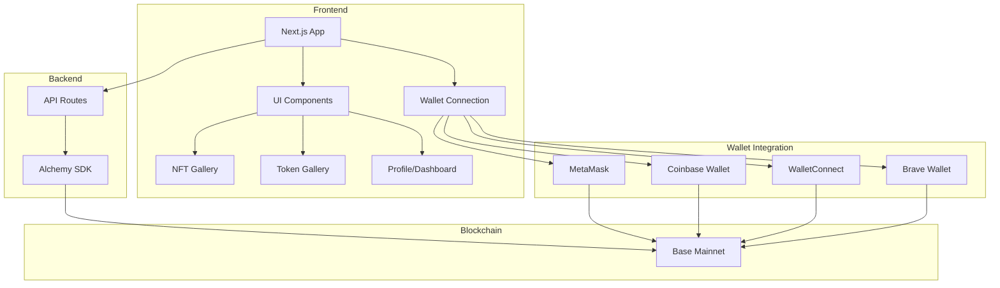

# base.brassey.io

A Web3 Dashboard for the Base blockchain with wallet connection, on-chain identity features, and NFT display capabilities.

## Architecture Overview



## Technical Stack

### Core Framework
- **Next.js 15**: React framework with App Router
- **React 19**: UI library
- **TypeScript**: Type-safe JavaScript

### Blockchain Integration
- **Wagmi**: React hooks for Ethereum
- **Viem**: Low-level Ethereum interface
- **Alchemy SDK**: Blockchain API integrations
- **@coinbase/onchainkit**: Base blockchain identity components

### Wallet Connection
- **MetaMask**: Browser extension wallet
- **Coinbase Wallet**: Mobile and browser wallet
- **WalletConnect v2**: Universal wallet connector
- **Brave Wallet**: Browser-integrated wallet support

### UI Components
- **Tailwind CSS**: Utility-first CSS framework
- **Radix UI**: Unstyled, accessible components
- **Lucide React**: SVG icon library
- **shadcn/ui**: Component collection built with Radix and Tailwind

### Data Management
- **TanStack Query**: Data fetching and caching library

## Environment Variables

Before running the project, you'll need to set up the following environment variables:

### Required Environment Variables

Create a `.env.local` file in the root of the project with the following variables:

```
# WalletConnect Project ID 
# Get one at https://cloud.walletconnect.com/
NEXT_PUBLIC_WALLETCONNECT_PROJECT_ID=your_project_id_here

# Alchemy API Key for Base
# Get one at https://dashboard.alchemy.com/
ALCHEMY_API_KEY=your_alchemy_api_key_here
```

### Optional Environment Variables
```
# For enhanced development logging
DEBUG=true
```

## Feature Overview

### Wallet Connection
The application supports multiple wallet connection methods:
- MetaMask browser extension
- Coinbase Wallet (mobile and extension)
- WalletConnect v2 (for connecting mobile wallets)
- Brave Wallet (integrated with the Brave browser)

### Base Chain Integration
- NFT gallery displaying tokens owned on Base
- Wallet balances for Base tokens
- On-chain identity resolution through OnchainKit
- ENS-compatible name resolution for Base addresses

### User Interface
- Dark mode UI with Base-inspired design
- Responsive layouts for mobile and desktop
- Accessible components meeting WCAG guidelines
- Custom wallet icons including Brave Wallet support

## Application Structure

```
app/                   # Next.js App Router structure
├── api/               # API routes for server-side operations
│   ├── block-height/  # Base blockchain height API
│   ├── nfts/          # NFT retrieval via Alchemy
│   └── wallet-config/ # Secure wallet configuration
├── dashboard/         # Dashboard page
├── profile/           # User profile page
└── layout.tsx         # Root layout with providers

components/            # Reusable React components
├── onchain-components.tsx # OnchainKit integration
├── wallet-card.tsx    # Wallet display with balance
├── wallet-connection-modal.tsx # Wallet connector UI
├── wallet-icon.tsx    # Custom wallet icons
└── nft-gallery.tsx    # NFT display component

context/               # React context providers
└── auth-context.tsx   # Authentication state management

hooks/                 # Custom React hooks
├── use-wallet-config.ts # Wallet configuration hook
└── use-cdp-project-id.ts # Coinbase Developer Platform hook

public/                # Static assets
└── wallet-icons/      # SVG wallet icons
```

## Development

To run the development server:

```bash
npm install
npm run dev
```

Open [http://localhost:3000](http://localhost:3000) with your browser to see the result.

## Deployment

The application is deployed on Vercel. When deploying, add these environment variables as Vercel secrets:
- `NEXT_PUBLIC_WALLETCONNECT_PROJECT_ID`
- `ALCHEMY_API_KEY` 