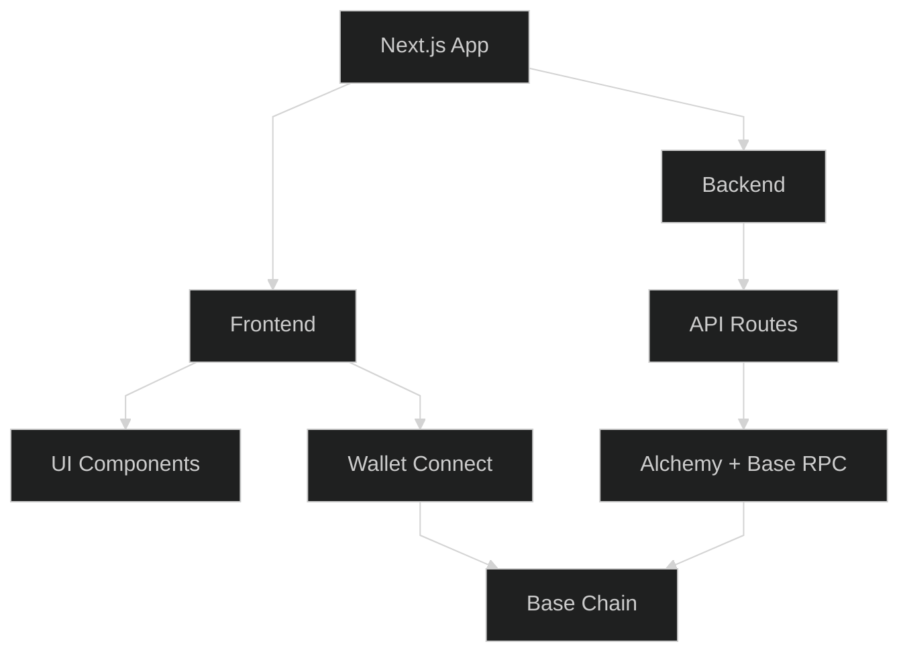

# base.brassey.io

A Base-native wallet dashboard: identity (Basename + avatar), ETH & ERC-20 balances, NFT gallery, send, and receive — rendered with wagmi + viem, with spam filtering on both tokens and NFTs.

## Architecture Overview


```mermaid
%%{init: {'theme':'dark', 'flowchart': {'useMaxWidth':false, 'htmlLabels':true, 'curve':'linear'}, 'securityLevel': 'loose', 'displayMode': true, 'showSequenceNumbers': false }}%%
flowchart TD
    A[Next.js App]
    A --> B[Frontend]
    A --> C[Backend]

    B --> D[UI Components]
    B --> E[Wallet Connect]

    C --> F[API Routes]
    F --> G[Alchemy + Base RPC]

    G --> H[Base Chain]
    E --> H
```

## Technical Stack

### Core Framework
- **Next.js 16.x** with App Router
- **React 19.x**
- **TypeScript 5.x**

### Blockchain Integration
- **wagmi** — React hooks for Ethereum / Base
- **viem** — low-level Ethereum interface (used to read the Base L2 Resolver for Basename + avatar resolution)
- **Alchemy SDK 3.x** — NFT and token balance RPC
- **@coinbase/onchainkit** — Basename / Identity / Socials components

### Wallet Connection
- MetaMask (extension)
- Coinbase Wallet (mobile + extension)
- WalletConnect v2 (any mobile wallet)
- Generic injected providers (Brave, Phantom EVM, etc.)
- Safe

### UI
- Tailwind CSS 3.4 (JetBrains Mono as the sole face, brassey.io palette)
- Radix UI primitives via shadcn/ui
- Lucide icons

### Data Management
- TanStack Query 5.x (queries are long-stale and do not auto-refetch to keep the dashboard calm)

## Environment Variables

Create a `.env.local` at the repo root:

```
# WalletConnect Project ID — https://cloud.walletconnect.com/
WALLETCONNECT_PROJECT_ID=your_project_id_here
NEXT_PUBLIC_WALLETCONNECT_PROJECT_ID=your_project_id_here

# Alchemy API Key for Base mainnet — https://dashboard.alchemy.com/
# Used for NFT + token RPC and as a fast RPC for Basename resolution.
ALCHEMY_API_KEY=your_alchemy_api_key_here
```

## Feature Overview

### Wallet Connection
Connect any of MetaMask, Coinbase Wallet, WalletConnect v2, Brave/Phantom injected, or Safe. Session is persisted to `localStorage` via the auth context so balances and avatar render immediately on every navigation (no rehydration flash).

### Onchain Identity (Basenames)
- `GET /api/avatar?address=0x…` reads the Basename L2 Resolver on Base directly:
  1. Reverse-resolves the address to its Basename.
  2. Reads the `avatar` text record.
  3. Falls back to Coinbase's default blue-face Basename SVG (deterministic per name) when no custom avatar is set.
- Rendered over a deterministic steel-blue→dark gradient tile so the avatar always paints, even if the RPC is briefly slow.

### Send
- Send modal on the wallet card. Supports native ETH (`useSendTransaction`) and ERC-20 tokens (`useWriteContract` → `transfer(address,uint256)`) on Base.
- Asset picker renders **only the tokens the wallet actually holds** — native ETH with a non-zero balance plus every non-spam ERC-20 from the token gallery. No fixed list.
- Inline balance + "max" fill, recipient address validation via `viem.isAddress`, chain auto-switch to Base if the wallet is elsewhere, and Basescan receipt link once confirmed.
- Runs entirely through your connected wallet — no CDP key, no third-party API.

### Receive
- Receive modal showing the wallet address alongside a locally-rendered QR code (via `qrcode`).
- Styled to match the terminal body (#1F1D20 / steel blue), with a small Base glyph in the center of the QR.
- One-click address copy and a Basescan deeplink.

### Tokens
- ERC-20 balances via Alchemy `alchemy_getTokenBalances` + `alchemy_getTokenMetadata`.
- Client-side spam heuristics in `lib/spam.ts` (URLs, airdrop/claim/visit/telegram keywords, suspicious unicode, overlong symbols, known-good allowlist). Spam tokens are hidden by default with a toggle to reveal.

### NFTs
- NFTs via Alchemy `getNFTs` on Base.
- Basenames and special-case tokens (e.g., the interactive chart NFT) always shown.
- Same spam heuristic applied to NFT name/description; toggle to reveal.

### Socials
Coinbase identity socials (Twitter / GitHub / Farcaster / Lens / website) via the project's own `/api/socials/proxy` route.

### Explorer
One-click jump to Basescan from the wallet card.

### UI
Dark terminal aesthetic matching brassey.io — JetBrains Mono everywhere, `#4B7F9B` steel blue accent, `#1F1D20` terminal body, grid ambient background.

## Application Structure

```
app/                          # Next.js App Router
├── api/
│   ├── avatar/               # Basename + avatar resolution (L2 Resolver)
│   ├── block-height/         # Base block number
│   ├── nfts/                 # NFT retrieval via Alchemy
│   ├── tokens/               # ERC-20 balances + metadata
│   ├── socials/proxy/        # Coinbase identity socials proxy
│   ├── onchain-config/       # Public CDP project id
│   └── wallet-config/        # WalletConnect project id
├── dashboard/                # Dashboard page
├── profile/                  # Profile page
├── identity/                 # Identity page
└── layout.tsx                # Root layout with providers

components/
├── ui/                       # shadcn/ui primitives
├── onchain-components.tsx    # BaseAvatar + BaseName + Socials
├── dashboard-header.tsx      # Fixed nav with wordmark
├── custom-dashboard.tsx      # Dashboard shell (wallet + tokens side-by-side)
├── wallet-card.tsx           # Balance hero + send / receive / explorer
├── send-modal.tsx            # Native ETH + ERC-20 transfer (wagmi-signed)
├── receive-modal.tsx         # Address + QR code deposit panel
├── token-gallery.tsx         # ERC-20 list with spam toggle
├── nft-gallery.tsx           # NFT grid with spam toggle
└── wallet-connection-modal.tsx

context/
└── auth-context.tsx          # localStorage-persisted auth

hooks/
├── use-profile.ts
├── use-tokens.ts
├── use-nfts.ts
├── use-block-height.ts
└── use-wallet-config.ts

lib/
├── basename-avatar.ts        # L2 Resolver ABI + default avatars
├── send-tokens.ts            # Sendable token list (ETH + ERC-20s on Base)
├── spam.ts                   # Token / NFT spam heuristics
└── utils.ts
```

## Node.js Version Requirements

- Node.js 20.12.0+
- pnpm 8.0.0+

## Development

```bash
pnpm install
pnpm dev
```

Open http://localhost:3000 in your browser.

## Deployment

Optimized for Vercel. Set these env vars in the Vercel project:
- `WALLETCONNECT_PROJECT_ID`
- `NEXT_PUBLIC_WALLETCONNECT_PROJECT_ID`
- `ALCHEMY_API_KEY`

Build command: `pnpm install --no-frozen-lockfile && pnpm run build`

## Quick API check

```bash
curl "http://localhost:3000/api/nfts?address=0x07b4E3A9134Bc88276e6Ff9516620755144CEC79" | jq .
curl "http://localhost:3000/api/avatar?address=0x07b4E3A9134Bc88276e6Ff9516620755144CEC79" | jq .
```
